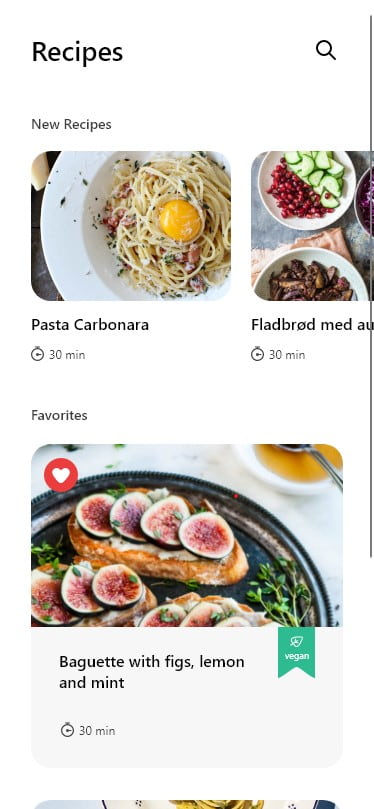

# Udvikling af Vue app med Tailwindcss
I denne opgave skal du lave en del af en app. Du har fået udleveret et design som du sammen med dine klassekamerater skal lave. I skal sammen med jeres lærer planlægge og bryde opgaven ned i delopgaver som i hver kan arbejde med på det samme GitHub repository. 

Formål og læringsmål er:

* Afprøve og udvikle din evne til at indgå i et teamarbejde
* Arbejde sammen med andre udviklere ved at anvende versionsstyring (GitHub)
* Forståelse for, og erfaring med at anvende relevante Vue teknikker.
* Praktisk anvendelse af Tailwindcss

For bedst at kunne løse opgaven skal du have kendskab til Vue og Tailwind, eller et andet lignende værktøj. Kendskab til Vuex og vue-router er et plus, men det kan også implementeres senere, når du får kendskab til det.

## Opgaven
Der skal laves en simpel webapp med Vue og [tailwindcss](https://tailwindcss.com/), som kan vise forskellige opskrifter med billeder, ingredienser og skridt. 

[Link til design, hvor I også kan downloade billeder og ikoner.](https://xd.adobe.com/view/b40720df-a5a4-4cfb-bdb8-1622a34a20ad-e154/)

Krav:

* Ligne det udleverede design
* Tag et aktivt valg om hvad der skal være components og havd der ikke skal.
* Tænk over hvordan sidens dele, sektioner og components skal være responsive. Fx 'New Recipes', hvis der kun er en ny opskrift? Hvordan skal det se ud når telefonen ligger på siden?

Når I er færdig med opgaven skal der ligge et git repository på GitHub.

### Ekstraopgaver
Hvis du bliver færdig hurtigt kan du lave nogle ekstraopgaver

* implementer VueX
* Implementer vue-router
* Opret hover effekter og tilføje transitions
* Lav et dark-theme
* Tilpas design så det ser bedre ud på desktop

## Tegn for færdiggørrelse
Tegn på hvad du har lært i opgaven

* Jeg fået erfaring med at arbejde i en gruppe og har reflekteret over hvad der virkede og ikke virkede
* Jeg har fået erfaring med at lave Vue components med tailwindcss
* Jeg har sent link til GitHub til min lærer